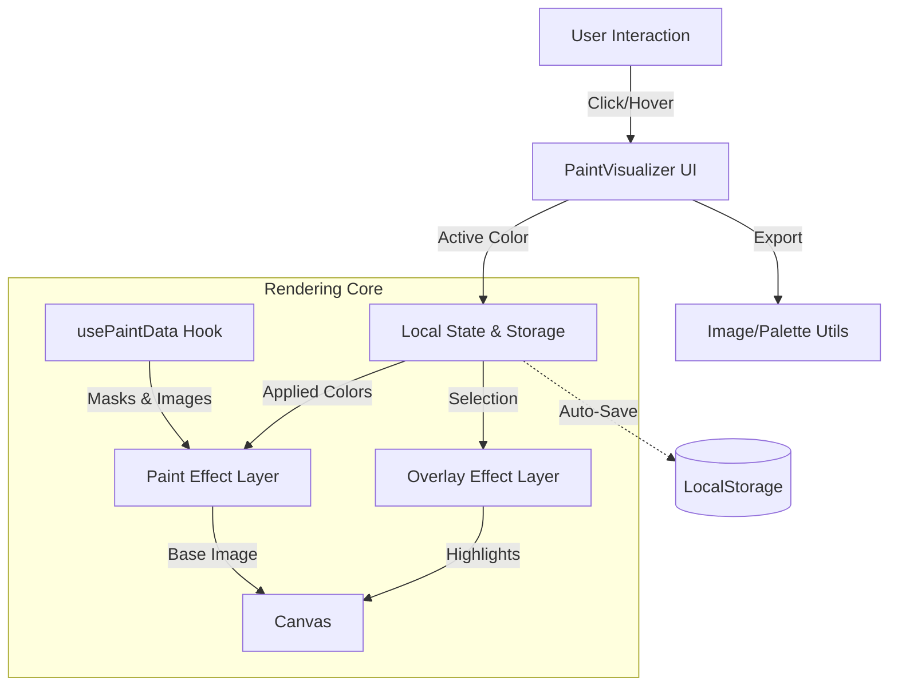

# Colourziller

<div align="center">
  
  <h1>Colourziller</h1>
  <p><strong>A high-performance, gamified architectural paint visualizer.</strong></p>
  
  [](https://nextjs.org/)
  [](https://www.framer.com/motion/)
  [](https://tailwindcss.com/)
</div>

---

**Colourziller** is a state-of-the-art visualization tool designed to help users experiment with architectural color palettes in real-time. Built with performance and aesthetics in mind, it transforms static building renders into interactive, paintable canvases.

## ✨ Key Features

### 🎨 Paint Visualizer
- **Smart Masking**: uses pre-generated mask data to instantly identify and select architectural regions (walls, trim, roof).
- **Realistic Rendering**: Preserves original lighting and texture using normal maps and luminosity blending.
- **Modes**: Switch between **Realistic** view and **X-Ray** visualization to see mask boundaries.

### 🎮 Gamified UX
- **Vercel-style Animations**: Smooth entry transitions, staggered list reveals, and satisfying micro-interactions using `framer-motion`.
- **Keyboard Shortcuts**: Hold `Shift + Click` to instantly paint a region.
- **Responsive Sidebar**: A unified control panel for color selection, region statistics, and tools.

### 🛠️ Productivity Tools
- **Export Utilized Palette**: View a dedicated list of only the colors you've actively used. Copy them as **JSON** or **CSS Variables**.
- **Image Export**: Download high-quality **PNG** or **JPG** snapshots of your work.
- **Persistent State**: Never lose your progress. Your selection, palette, and active building are automatically saved to `localStorage`.

### ⚡ High Performance
- **Split-Layer Rendering**: Separates heavy image painting from lightweight UI overlays, ensuring 60fps interaction.
- **Memoized Logic**: Heavy color math (OKLCH/HSL conversions) is pre-calculated.
- **Efficient Hooks**: Custom `usePaintData` hook manages asset loading and caching.

---

## 🏗️ Architecture

Colourziller uses a highly optimized rendering pipeline to handle complex image manipulation in the browser.



---

## 🚀 Getting Started

1.  **Clone the repository**
    ```bash
    git clone https://github.com/yourusername/colourziller.git
    cd colourziller
    ```

2.  **Install dependencies** (We use `pnpm`)
    ```bash
    pnpm install
    ```

3.  **Run the development server**
    ```bash
    pnpm dev
    ```

4.  **Open the app**
    Visit [http://localhost:3000](http://localhost:3000) to start painting.

---

## 📦 Project Structure

-   `components/PaintVisualizer.tsx`: The heart of the application. Handles canvas rendering and UI logic.
-   `lib/maskUtils.ts`: High-effiency algorithms for pixel lookup and mask detection.
-   `lib/colorUtils.ts`: Utilities for color space conversions (Hex <-> RGB <-> HSL).
-   `public/assignment_testing_images/`: Source assets for the visualization demo.

---

<div align="center">
  <p>Built with ❤️ for the future of design tools.</p>
</div>
